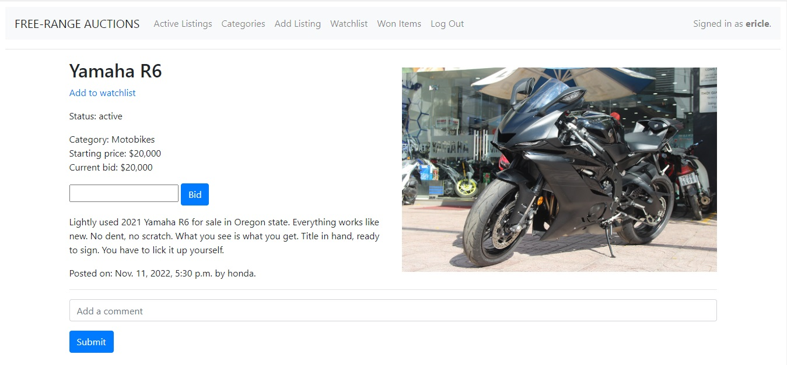

# Auction Site

An eBay-like e-commerce auction site that will allow users to post auction listings, place bids on listings, 
comment on those listings, and add listings to a “watchlist.”



## Getting Started

### Dependencies

To be able to use the program, you should install the following modules:

```
pip install django
```

### Installing

To download this program, enter the following command in your terminal:
```
git clone https://github.com/erichoangnle/auction_site.git
```

## Specification

### Models

This application make use of 6 models: User, Listing, Won, Bid, Comment, and Watchlist.

### Create Listing

Users should be able to visit a page to create a new listing. They should be able to specify a title 
for the listing, a text-based description, and what the starting bid should be. Users should also 
optionally be able to provide a URL for an image for the listing and/or a category (e.g. Fashion, 
Toys, Electronics, Home, etc.).

### Active Listings Page

The default route of this web application should let users view all of the currently active auction 
listings. For each active listing, this page should display the title, description, current price, 
and photo (if one exists for the listing).

### Listing Page

Clicking on a listing should take users to a page specific to that listing. On that page, users should 
be able to view all details about the listing, including the current price for the listing.
 * If the user is signed in, the user should be able to add the item to their “Watchlist.” If the item 
 is already on the watchlist, the user should be able to remove it.
 * If the user is signed in, the user should be able to bid on the item. The bid must be at least as 
 large as the starting bid, and must be greater than any other bids that have been placed (if any). 
 If the bid doesn’t meet those criteria, the user should be presented with an error.
 * If the user is signed in and is the one who created the listing, the user should have the ability 
 to “close” the auction from this page, which makes the highest bidder the winner of the auction and 
 makes the listing no longer active.
 * If a user is signed in on a closed listing page, and the user has won that auction, the page should say so.
 * Users who are signed in should be able to add comments to the listing page. The listing page should 
 display all comments that have been made on the listing.
 
### Watchlist

Users who are signed in should be able to visit a Watchlist page, which should display all of the listings 
that a user has added to their watchlist. Clicking on any of those listings should take the user to that listing’s page.

### Categories

Users should be able to visit a page that displays a list of all listing categories. Clicking on the name of any 
category should take the user to a page that displays all of the active listings in that category.

## Contact

Email: erichoangnle@gmail.com

Facebook: https://www.facebook.com/eric.le.520900

Project link: https://github.com/erichoangnle/auction_site.git
